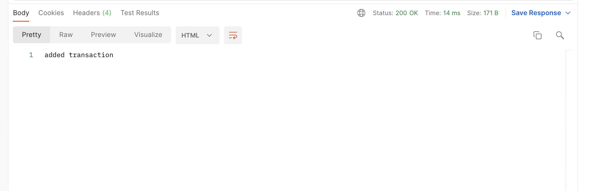
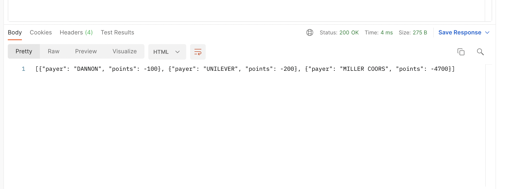
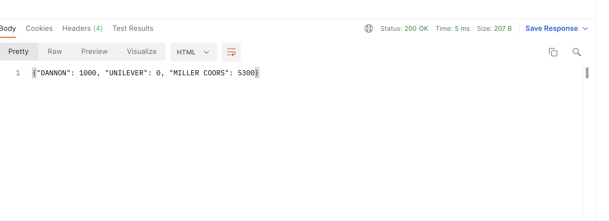

# FetchRewards-Assignment
This is a take home assignment for FetchRewards. <br>
Framework used : <br>
Python3, Flask

## Problem statement : <br>
Provide routes that: <br>
Add transactions for a specific payer and date. <br>
Spend points using the rules above and return a list of ​{ "payer": <string>, "points": <integer> }​ for each call. <br>
Return all payer point balances. <br>

## Installations
## Steps to install python3 in MAC OS
### steps to install homebrew: <br>
open terminal and run ``` $ /bin/bash -c "$(curl -fsSL https://raw.githubusercontent.com/Homebrew/install/master/install.sh)" ```
Add the following line at the bottom of your ``` ~.profile ``` file <br>
``` export PATH="/usr/local/opt/python/libexec/bin:$PATH" ``` <br>

 ```  $ brew install python ```
 By default pip is installed. 
 To check python version run ``` $ python3 ``` 

 ## Steps to install python3 in windows
 Download python from [link](https://www.python.org/downloads/)

 ## Steps to install flask 
 Clone the repo into the project folder. Navigae to the folder.
 To upgrade pip ``` python -m pip install --upgrade pip ``` <br>
 To install flask ``` python -m pip install flask ``` <br>
 It runs the flask server on port 5000 <br>


 ## Steps to run the project locally
 Clone the repo ``` git clone https://github.com/Ashwin1234/FetchRewards-Assignment ```
 Navigae to the project folder. 
 Run the command ``` python3 -m flask run ``` to run the project.

 ## API Documentation
 The endpoint - http://127.0.0.1:5000/add_transaction is a POST request which expects a set of transactions. This API stores them in a local variable. <br>
 result <br>
 
 <br>
 <br>

 The endpoint - http://127.0.0.1:5000/spend_points is a POST request which expects total points to be spent. The is API computes the points spent by each buyer. The logic here is that oldest transaction by timestamp is used to deduct the points and points are only reduced if they are positive. Returns a JSON response with each payer and the points deducted from their account. <br>
result <br>
 
 <br>
 <br>


 The endpoint - http://127.0.0.1:5000/point_balances is a GET request which returns a JSON response with the total balance available for each user. <br>
 result <br>
 

 ## Testing
 There are 4 test cases overall <br>
 To run the test cases run   ``` python3 test_app.py ```


 


